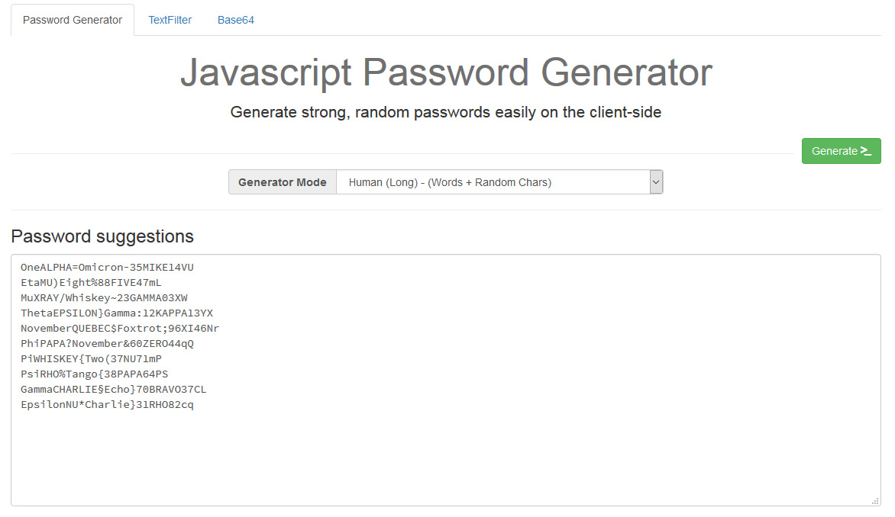

WebTools
=========================

A bunch of **Javascript based utilities** - public available on [tools.andidittrich.de](https://tools.andidittrich.com/)

Features
---------------------------------------------

* [Password Generator](https://tools.andidittrich.com/PasswordGenerator.html) - Generate strong, random passwords easily on the client-side
* [ReExp TextFilter](https://tools.andidittrich.com/TextFilter.html) - Apply Javascript Regular Expressions online to arbitrary text.
* [Base64 Encoder/Decoder](https://tools.andidittrich.com/Base64.html) - Encoder/Decoder using WebAPI
* [Token generator](https://tools.andidittrich.com/Token.html) - Generate Random Tokens

License
----------------------------------------------

WebTools is OpenSource and licensed under the Terms of [Mozilla Public License 2.0](https://opensource.org/licenses/MPL-2.0). You're welcome to [contribute](docs/CONTRIBUTING.md)